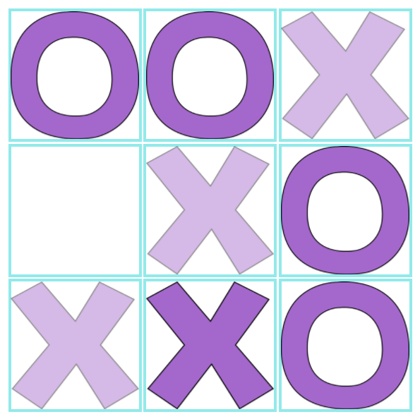
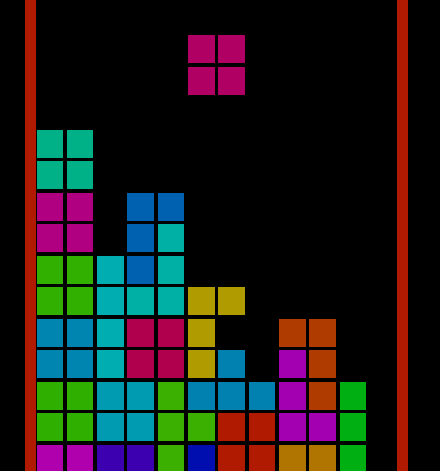

something build in 1 day

also check out my [vue.js rewrite](https://github.com/cuteapple/web-items-vue) of this repo

---

- **vanilla es6** (zero dependency)
- css3
- html5

- **easy and clean code**
- keep it simple

- **suggestion for topic is pretty welcome**

---

- ooxx https://cuteapple.github.io/web-items/ooxx/

---

- 8-puzzle https://cuteapple.github.io/web-items/8-puzzle/

---

- snake https://cuteapple.github.io/web-items/snake/

---

- game of life https://cuteapple.github.io/web-items/game%20of%20life/css%2Bjs

- game of life (WebGL) https://cuteapple.github.io/web-items/game%20of%20life/webgl

---

- tetris https://cuteapple.github.io/web-items/tetris/

---

[blog posts (Chinese/TW)](http://cuteappleplayintheweb.blogspot.com/search/label/%E8%A3%BD%E4%BD%9C%E4%B8%80%E4%BA%9B%E6%9D%B1%E8%A5%BF) contains some tutorial(?)
