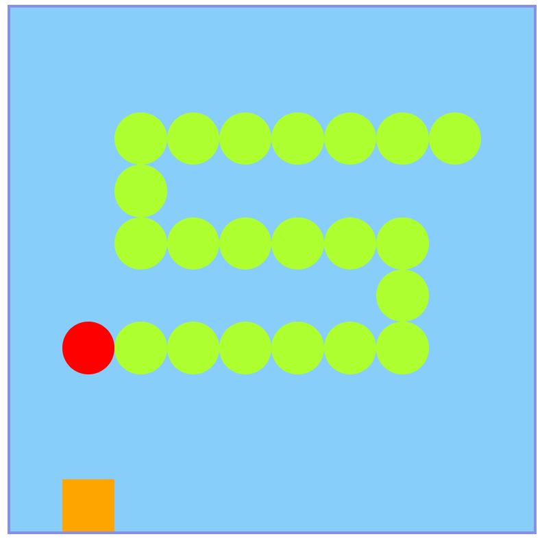

something

---

- **vanilla es6** (zero dependency)
- css3
- html5

- **easy and clean code**
- keep it simple

---

- ooxx https://cuteapple.github.io/web-items/ooxx/

---

- 8-puzzle https://cuteapple.github.io/web-items/8-puzzle/

---

- snake https://cuteapple.github.io/web-items/snake/

---

- game of life https://cuteapple.github.io/web-items/game%20of%20life/css%2Bjs

- game of life (WebGL) https://cuteapple.github.io/web-items/game%20of%20life/webgl

---

- tetris https://cuteapple.github.io/web-items/tetris/

---

**suggestion for topic is pretty welcome**
